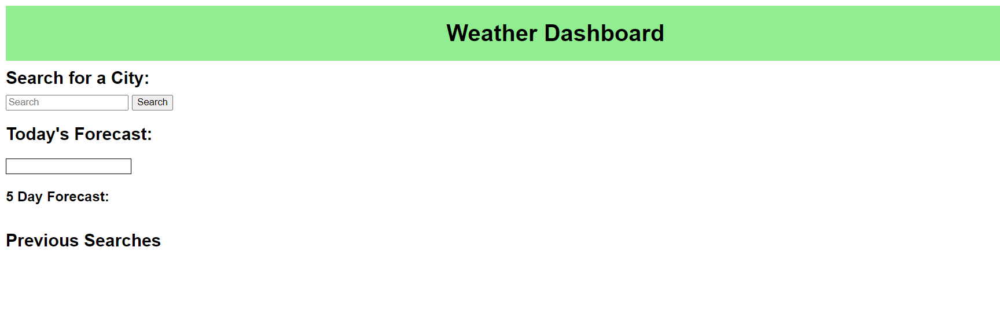

# Weather-Dashboard-06

## Description

I wanted to create a web application where I can view today's weather as well as a 5 day forecast for any city that I type into the search bar. Additionally, for convenience I wanted to be able to look at all my previous searches and view the weather again.

## Installation

To install code, run the following command:
Git clone <paste SSH key>

## Deployed Link

https://sherryk1103.github.io/Weather-Dashboard/

## Usage

## Process Steps

1. Created a unique GitHub repo for this project.
2. Created proper files and file structure, linked stylesheet and JavaScript to HTML
3. Set up API's for 5 day forecast and geo location data
4. Created variables, functions, and objects in JavaScript
5. Added styling for good UI
